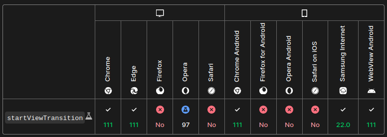
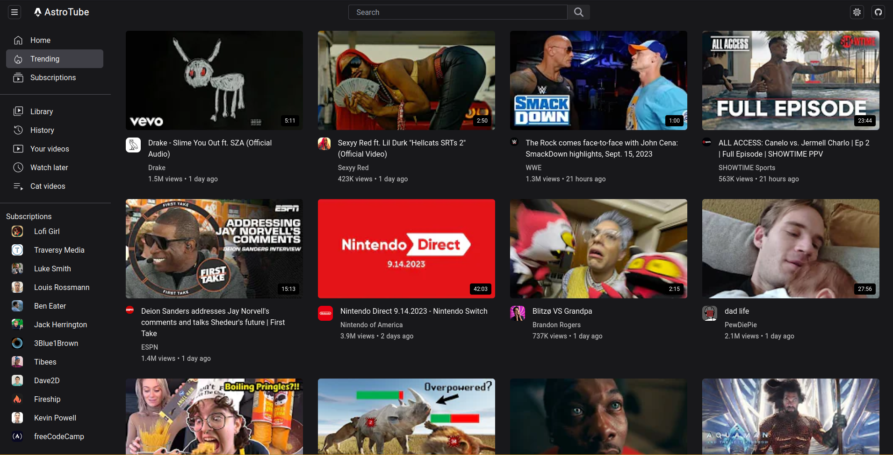
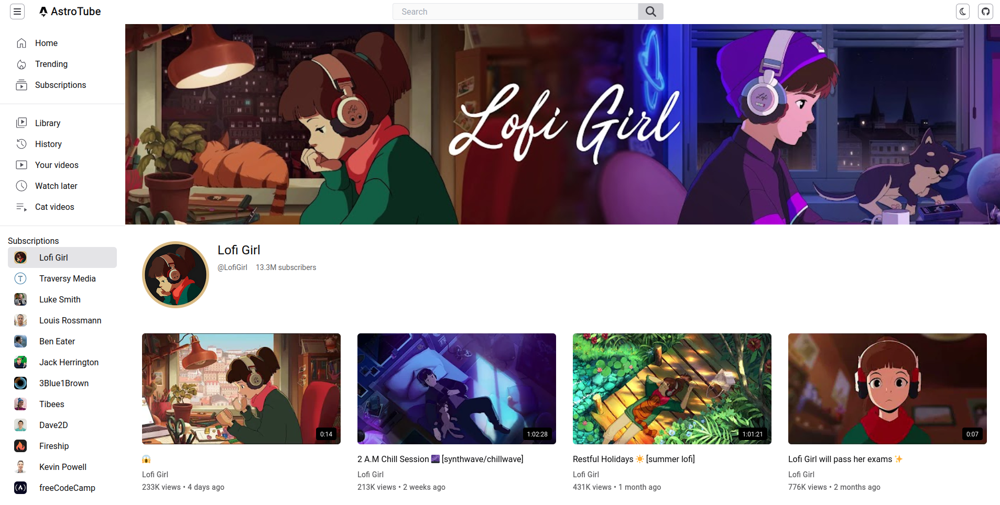

# AstroTube

A simple Server Side Rendered YouTube clone for showcasing Astro 3 View Transitions. Built with Astro, Svelte, Tailwind.

[View Transitions](https://docs.astro.build/en/guides/view-transitions/) update the page content without the browser's normal, full-page navigation refresh and provide seamless animations between pages. It is powered by the new [View Transitions browser API](https://developer.chrome.com/docs/web-platform/view-transitions/). For best experience make sure you're using a [supported browser](https://developer.mozilla.org/en-US/docs/Web/API/View_Transitions_API#browser_compatibility), although Astro provides smart fallbacks for unsupported browsers.

Supported browsers(as of 18-09-2023)


## Live Demo
Live Demo of the project is available [here](https://astrotuube.vercel.app).

## Preview
**Trending feed**(dark mode):


**Channel Page**(light mode):


## Run locally

1. Clone this repository
```sh
git clone https://github.com/sandeepdotcode/youtube-view-transition.git
```

2. Go to the project directory
```sh
cd youtube-view-transitions
```

3. Install dependencies

If you have pnpm
```sh
pnpm install && pnpm dev
```

for npm,
```sh
rm pnpm-lock.yaml
npm install && npm run dev
```

## What I learned

By doing this project, I learned:
- Astro Islands architecture
- Using external libraries like React and Svelte within Astro
- Astro Server Side Rendering(SSR) and Static Site Generation(SSG)
- Integrating a REST API to an Astro SSR site
- Using View Transitions API using Astro for page transitions in Multi Page Sites
- Controlling script behaviour in Astro
- Using advanced tailwind features like group and peer selectors
- Undoing changes after last git commit, making new changes and replacing old commit already pushed to GitHub
